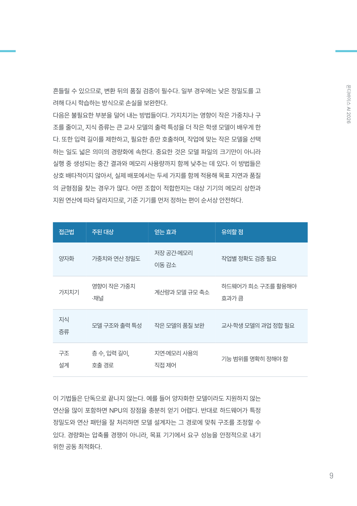

# bookforge

**One-line topic → commercial-book-quality ebook PDF.** An agent skill that runs on both Claude Code and OpenAI Codex.

[한국어](README.md)

bookforge produces PDFs with real book anatomy — cover, leader-dot TOC, chapter openers, running heads, colophon. Content is written in plain Markdown; typesetting is owned by six style packs and deterministic scripts; quality is physically enforced by QC gates — a PDF that fails the gates cannot exist in `final/`. Page breaking, filling, and intentional whitespace follow a pagination rulebook ([references/pagination.md](references/pagination.md)) distilled from measurements of commercial books; density gates catch both unjustified emptiness and forced filler.

The gates do not stop at the output. The style pack's color and numeric contracts are validated before rendering (G16), the class of accidents where an entire document silently shrinks is blocked by checking absolute type size against its declaration (G1-SCALE), and diagram placement that splits a page or exceeds the text frame is re-verified on the final pages (G17). Gate sensitivity itself is pinned by a mutation suite (`tests/mutations/`) — it injects defects into a passing book and verifies the gates catch them, and verifies a clean book is not falsely flagged, across 25 verdict axes (including the unmutated control M0).

The demo video and three example PDFs are attached to the [v2.0.0 release](https://github.com/gongnyang/bookforge/releases/tag/v2.0.0).

## Nine examples — every one produced by this skill

All six styles ship a real example, and `practical`, `insight`, and `business` each add a second book where the diagram track is the whole point, for nine total. The two practical books and *On-Device AI 2026* are rebuilt with the current code (numeral cover, multi-page TOC, and the global-shrink repair applied); the other six are as built at the v2.0.0 release. Click a cover to open the full PDF.

| | | |
|:---:|:---:|:---:|
| [](examples/practical-prompt-patterns.pdf) | [](examples/insight-ondevice-ai.pdf) | [](examples/academic-game-theory.pdf) |
| **practical** how-to book<br>*24 Prompt Patterns*, 45p | **insight** tech report<br>*On-Device AI 2026*, 31p | **academic** scholarly<br>*Foundations of Game Theory*, 36p |
| [](examples/essay-evening-sentences.pdf) | [](examples/business-sme-ai.pdf) | [](examples/magazine-trend-brief.pdf) |
| **essay** minimal essays<br>*Sentences on the Way Home*, 32p | **business** consulting white paper<br>*SME AI Adoption Strategy*, 28p | **magazine** trend magazine<br>*TREND BRIEF*, 25p |
| [](examples/insight-agent-protocols.pdf) | [](examples/practical-home-server.pdf) | [](examples/business-automation-redesign.pdf) |
| **insight** diagram-led<br>*AI Agent Protocols 2026*, 32p | **practical** diagram-led<br>*Your Own Home Server*, 39p | **business** diagram-led<br>*Redesigning Work Automation*, 31p |

## Diagram track

Body diagrams are declared by the agent as sidecar files; the build normalizes and validates them and places them as vectors. There are two tracks.

1. **antv** — key-point visualizations (sequence-of-steps, comparison, hierarchy, numeric trend) are declared in `diagrams/fig-NN.json` using the AntV Infographic DSL. The renderer runs SSR against a vendor bundle committed to the repo (`vendor/antv-ssr.bundle.mjs`, pinned to `@antv/infographic` 0.2.19) and converts the original output's `<foreignObject>` text to native `<text>` (fo2text), preventing the accident where Typst (usvg) silently drops text.
2. **authored** — the 11 technical-diagram families the AntV catalog does not cover (sequence, state machine, ER, swimlane, Gantt, radar, Venn, scatter, org chart, loop, permission matrix) are drawn by the agent as SVG. Put `diagrams/fig-NN.svg` plus the sidecar `{"kind":"authored"}` and the build normalizes it — font baking, palette enforcement, label-overlap checks, an 8pt minimum — into `assets/fig-NN.svg`. The authoring contract, type routing, connector rules, and complexity budgets are canonically defined in [references/diagrams.md](references/diagrams.md) (absorbed from the [cathrynlavery/diagram-design](https://github.com/cathrynlavery/diagram-design) (MIT) spec, rewritten for Korean typesetting, palette tokens, and the gate system).

Diagram color and size are bound to the style pack by contract. Every palette color declares a role (`palette_roles`: label, fill, stroke), so using a label color as a fill is a gate failure, and label type size cannot exceed a ceiling relative to body copy (`diagram.labelBand.maxRatio`). Placement height is a contract too — a diagram exceeding `diagram.maxHeightMm` is pre-shrunk or rejected at render time (figFitReport), and even a bypass of that is caught on the final PDF by G17-FIGFIT (page splits, frame overruns, and a static recomputation of placed height). Sources are verified before rendering by G0; the physical presence of label text in the PDF is verified after rendering by G13.

| insight — hierarchy (tree) | business — swimlane | practical — flowchart |
|:---:|:---:|:---:|
|  |  |  |

## TOC system

Every style has its own TOC grammar, and that grammar is a declared contract. A single layout catalog in the skill (`TOC_LAYOUTS`, six layouts) registers each layout's level count, leader-dot usage, and measured size caps; a pack only picks a name via `toc_layout` in its `tokens.json` — if the theme's actual implementation drifts from the declaration, G16-SYNC catches it before the build.

| Layout | Styles | Grammar |
|---|---|---|
| `hanging-two-level` | insight | chapter rows + indented section rows; on overflow, **multi-page TOC** (`toc_overflow: paginate` — two-pass page-number markers) |
| `spread-single-level` | magazine | fixed single spread, chapter level only; overflow halts the build |
| `display-numeral` | business · magazine (alternate) | large chapter-number column on the left, titles/sections on the right |
| `twocol-balanced` | practical | header band + chapter ordinal chips + dotted leaders; on overflow, balanced two-column split |
| `academic-flow` | academic | number column + title + right-edge folio |
| `flush-single-level` | essay | chapter level only, leaders forbidden |

Beyond the default layout, an **alternate overlay** can be enabled per book — declaring `toc_layout` in `book.json` typesets the magazine TOC as `display-numeral`, and alternate layouts carry their own measured capacity contract (`toc_capacity_alt`). Multi-page-TOC styles can additionally publish a **list of figures and tables** (`toc_lists`, opt-in) as separate front-matter pages, with their printed page numbers gate-verified too.

TOC and design consistency is scanned by G14 across five axes: **A** printed TOC page numbers ↔ actual folios / **B** TOC ↔ chapter-opener color (hue family) / **C** WCAG contrast floor for chromatic text / **D** section-row page numbers ↔ actual section start pages / **E** figure/table list ↔ actual caption pages. The two TOCs below are actual passing output.

| insight — side band, folios | business — indicators, chapter numbers |
|:---:|:---:|
|  |  |

## Interior previews

| practical — callouts, procedure page | business — tables, data grounding | magazine — image and pull-quote page |
|:---:|:---:|:---:|
|  |  |  |

| academic — definition boxes, section hierarchy | essay — whitespace-led page | insight — narrow measurement table |
|:---:|:---:|:---:|
|  |  |  |

## Six styles

Each style ships a rulebook (`styles/*/STYLE.md`) distilled from measurements of real commercial publications — trim size in mm, font sizes in pt, leading percentages, color tokens, page templates, and prohibitions.

| Style | Identity | Trim | Engine |
|---|---|---|---|
| `practical` | IT how-to books. Narrative sits low in serif (Noto Serif KR); operations, labels, and figures stand in sans (Pretendard) — "reading text" and "doing text" separated by typeface | 153×225 | Typst |
| `insight` | tech trend report (research-institute insight) | 182×257 | HTML→Chromium |
| `academic` | scholarly monograph (three-rule tables, numbered section hierarchy) | 153×225 | Typst |
| `essay` | minimal essays (single ink + one accent color) | 128×188 | Typst |
| `business` | consulting white paper (navy system, action titles, key stats) | 200×280 | Typst |
| `magazine` | trend magazine (editorial grid, pull-quote pages) | 200×265 | HTML→Chromium |

`practical` covers are a catalog too — the default is `numeral` (an oversized ghost numeral on white), and `cover_variant` in `book.json` opts into `ribbon` (the former default), `block`, `grid`, or `obi`. A value outside the catalog fails immediately with no silent fallback.

## Install

```bash
git clone https://github.com/gongnyang/bookforge.git
cd bookforge

# Symlink into both Claude Code and Codex (both officially support symlinks)
ln -sfn "$PWD" ~/.claude/skills/bookforge
ln -sfn "$PWD" ~/.codex/skills/bookforge
ln -sfn "$PWD" ~/.agents/skills/bookforge
```

Requirements (self-checked before every run):

- **Typst 0.14+** — `practical`, `academic`, `essay`, `business`
- **Python 3 + PyMuPDF + markdown-it-py** — conversion and QC gates (`pip install pymupdf markdown-it-py`)
- **Global Playwright (Chromium)** — `insight`, `magazine`, **and every book that uses diagrams (`diagrams/`)** (diagram prerendering goes through the Chromium harness even for Typst styles) — `npm i -g playwright && npx playwright install chromium`. The build resolves playwright from the **global** `npm root -g`; a project-local install is not picked up
- **Only for books with diagrams** — the renderer uses the vendor bundle committed to the repo (`vendor/antv-ssr.bundle.mjs`). **`npm ci` is not required** — the build reproduces even if the npm registry disappears. Only if the bundle is lost, restore it from the skill folder with `npm ci && node vendor/build-bundle.mjs`

Fonts: five OFL families (Pretendard, Noto Serif KR, Paperlogy, Gmarket Sans, Barlow) are bundled **entirely as TrueType (TTF)** and render out of the box — Chromium's print-to-PDF cannot subset CFF (.otf) and silently falls back to Type3, redrawing glyphs as vectors on every page (measured: identical body copy produced 19 Type3 objects from OTF vs. 1 Type0 subset and 0 Type3 from converted TTF). The G2 gate enforces zero Type3 as a hard condition — [license notice](assets/fonts/LICENSES.md).

## Usage

Just tell the agent:

```
"Make an insight-style ebook on on-device AI trends"     ← topic mode: research → outline → writing → typesetting
"Typeset this manuscript (draft.docx) as an essay book"  ← manuscript mode: ingest → typesetting
```

The skill detects the mode, picks style and length, and runs to completion. For chapters that need diagrams, drop `diagrams/fig-NN.json` (antv) or `diagrams/fig-NN.svg` (authored) and the build prerenders them automatically. Manual runs also work:

```bash
python3 scripts/scaffold.py mybook --style essay --title "Title" --length short
# write chapters/*.md and outline.json, then
python3 scripts/build.py mybook        # → draft/book.pdf (diagrams prerender here)
python3 scripts/qc_gate.py mybook      # only on pass → final/mybook.pdf
```

## Quality gates

Only the gate script can create `final/`. Seventeen machine gates with 30 verdict axes are registered in `gate-report.json`, plus the visual inspection G6 (the agent examines the contact sheet with its own eyes).

| Gate | Checks |
|---|---|
| G0 | (pre-render) diagram SVG sources — residual `foreignObject`, missing text, external references, standalone-paragraph violations, sidecar integrity, dropped icons |
| G1 | render success + trim size (`tokens.trim_mm`) + page-count preset range (WARN — HARD only with `--strict-pages`) + **G1-SCALE: absolute body type size vs. `tokens.body_pt` — the only axis that detects the accident class where Chromium shrink-to-fit silently scales the whole document past every relative-metric gate** |
| G2 | all fonts embedded + **zero Type3 glyphs** |
| G3 | page geometry, 3 axes — **OVERFLOW** (zero bboxes outside trim, 1.5pt tolerance) · **COLLIDE** (zero intersecting text lines per page; multi-column compared per column band) · **FIT** (front-matter text inside the declared `front_frame_mm`) |
| G4 | TOC and bookmarks ↔ actual chapter start pages |
| G6 | contact-sheet visual inspection — the agent verifies real pages by eye |
| G7 | density, 5 axes — frame drift, unintended blank pages, short tails, mid-page gaps, whole-document (reach/ink/gap) |
| G8 | air-fill detection (padding pages by inflating leading or tracking) |
| G9 | end-of-page heading orphans and widows (single-column styles) |
| G10 | (pre-render) callout, quote, and stat figures must exist in the chapter body — fabrication blocked |
| G11 | `pageroles.json` integrity (declared-whitespace reason codes) |
| G12 | zero filler blank pages before chapter starts (no print-era recto alignment in single-sided ebooks) |
| G13 | (post-render) diagram labels exist as real PDF text — final catch for text dropped in SVG→PDF conversion |
| G14 | TOC and design consistency, 5 axes — A printed TOC page numbers ↔ folios / B TOC ↔ chapter-opener hue family / C WCAG contrast floor for chromatic text (3:1 large, 4.5:1 otherwise) / D section-row page numbers ↔ section start pages / E figure/table lists ↔ caption pages |
| G15 | page rhythm, 2 axes (`business` only, enforced only where measurements exist) — paragraphs over 8 lines / cap on consecutive body pages without a visual element |
| G16-TOKENS | (pre-render, in `build.py`) style pack token contract, 3 axes — **SYNC** (engine ↔ pack reality, palette roles, TOC layout catalog, diagram width substitution contract) / **CONTRAST** (declared pairs' WCAG contrast vs. pt/bold-derived floors) / **BRAND** (brand input format, substitution-point contrast, companion-color hue) . **The only gate that can halt the build in place**, so on failure `gate-report.json` does not exist yet — read the axis and reason from stderr and fix `styles/<style>/tokens.json` |
| G16-LINT | (in `qc_gate`, html engines only) `contrast_contract` ↔ `theme.css` and rendered DOM — completeness (WARN) / pt agreement (HARD) / value coverage (HARD). Typst styles have no rendered DOM and are explicitly skipped |
| G17-FIGFIT | (post-render) each diagram figure fits on one page — page splits, frame overruns, static recomputation of placed height ≤ `diagram.maxHeightMm`. Double defense on the final pages against bypasses of the render-time pre-shrink/reject (figFitReport) |

Thresholds and remedies are canonically defined in [references/pagination.md](references/pagination.md); the diagram authoring contract in [references/diagrams.md](references/diagrams.md). Gate sensitivity itself is guarded by the mutation suite — `python3 tests/mutations/run_mutations.py <passing book>` regression-tests both directions (detection and false positives) with 24 defect-injection axes plus an unmutated control.

## Structure

```
SKILL.md            router (mode detection → pipeline → sub-document pointers)
AGENTS.md           session-mode split (skill use vs. maintainer)
modes/              topic.md · manuscript.md
styles/<6>/         STYLE.md (rulebook) + theme.typ|theme.css + tokens.json
templates/base.typ  shared Typst book primitives
vendor/             antv-ssr.bundle.mjs (committed AntV SSR bundle — offline reproducibility) + build-bundle.mjs
scripts/            scaffold · build (+G16-TOKENS) · build_html (two-pass multi-page TOC) · qc_gate ·
                    tocgate (G14) · g16_tokens · render_diagrams (diagram prerender) · refit ·
                    contact_sheet · convert_fonts (TTF conversion) · fetch_fonts · ingest_docx
tests/              lint_contrast.py (G16-LINT) · mutations/ (gate sensitivity regression suite)
references/         pagination rulebook (pagination.md) · diagram contract (diagrams.md) ·
                    generated-art policy · orchestration · style pack extension guide (extending.md)
examples/           9 example PDFs + 36 showcase cuts
```

Generated-image policy: cover and body art use **text-free generated images** only; all lettering is placed as vectors by the typesetting layer. Books containing generated images say so in captions and the colophon.

## License

Code and docs: MIT. Bundled fonts: each font's OFL 1.1 ([notice](assets/fonts/LICENSES.md)). The nine example PDFs are demo output of the skill.
