# bookforge

**주제 한 줄 → 상업도서급 전자책 PDF.** Claude Code와 OpenAI Codex 양쪽에서 동작하는 에이전트 스킬입니다.

[English](README.en.md)

표지·리더선 목차·장 도비라·러닝 헤드·판권면까지 실제 단행본의 해부 구조를 갖춘 PDF를 만듭니다. 콘텐츠는 마크다운으로만 쓰고, 조판은 6개 스타일 팩과 스크립트가 전담하며, 품질은 QC 게이트가 물리적으로 강제합니다 — 게이트를 통과하지 못한 PDF는 `final/`에 존재할 수 없습니다. 페이지를 어떻게 나누고, 채우고, 비우는지는 상업 단행본 실측에 기반한 배치 규칙서([references/pagination.md](references/pagination.md))가 정하며, 밀도 게이트가 "이유 없는 비움"과 "억지 채움"을 수치로 잡아냅니다.

## 예시 6종 — 전부 이 스킬이 만든 실물입니다

여섯 주제 × 여섯 스타일. 각 표지를 클릭하면 PDF 전문이 열립니다.

| | | |
|:---:|:---:|:---:|
| [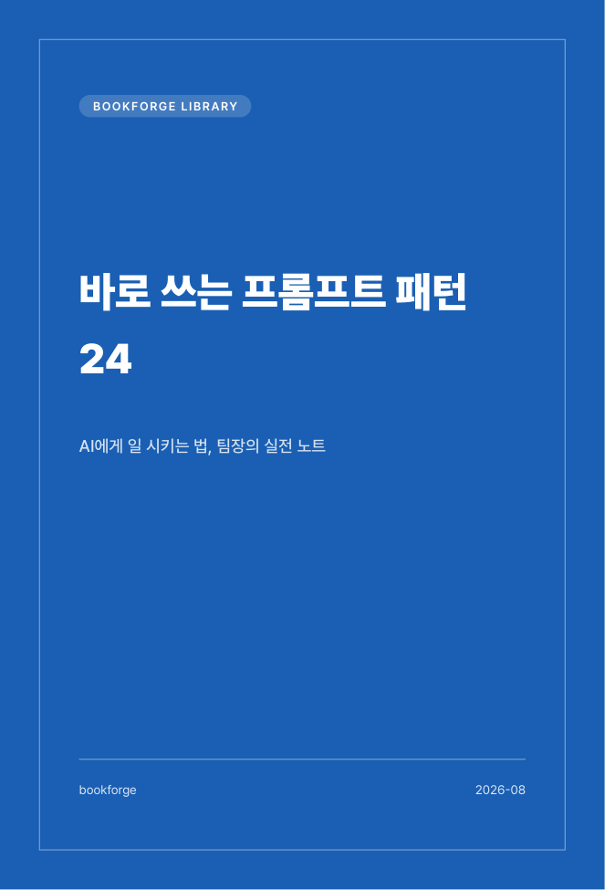](examples/practical-prompt-patterns.pdf) | [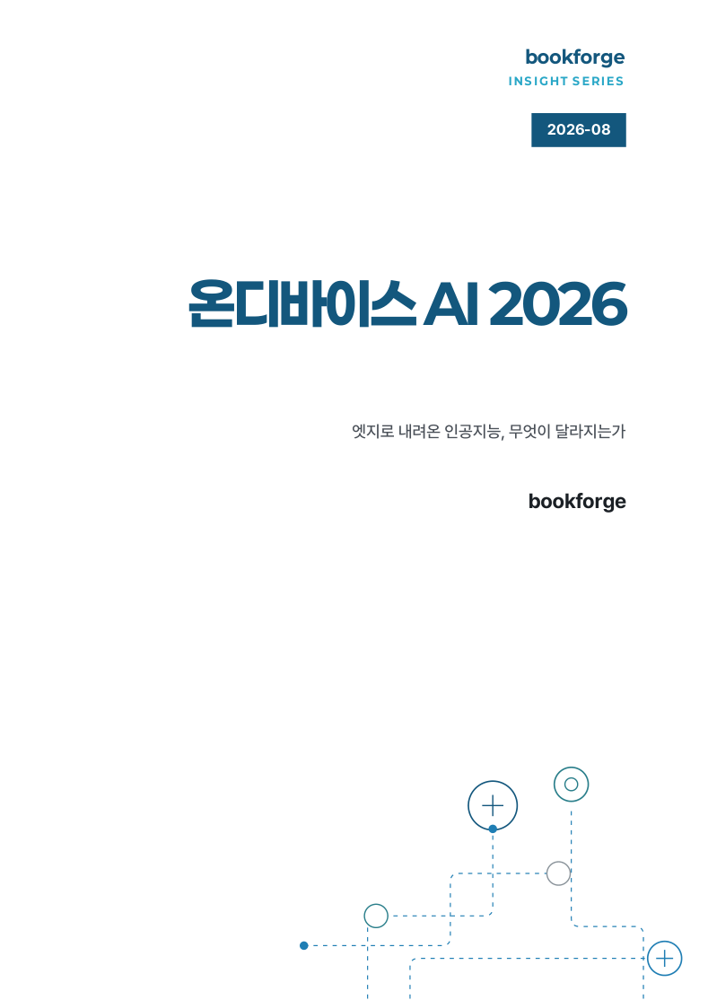](examples/insight-ondevice-ai.pdf) | [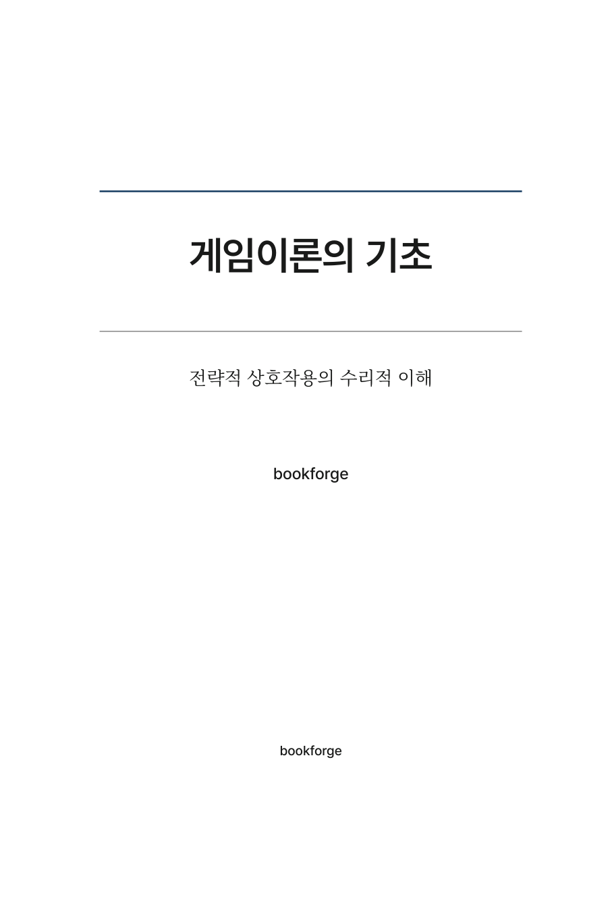](examples/academic-game-theory.pdf) |
| **practical** 실용·활용서<br>『바로 쓰는 프롬프트 패턴 24』 28쪽 | **insight** 기술 리포트<br>『온디바이스 AI 2026』 30쪽 | **academic** 학술·논문형<br>『게임이론의 기초』 35쪽 |
| [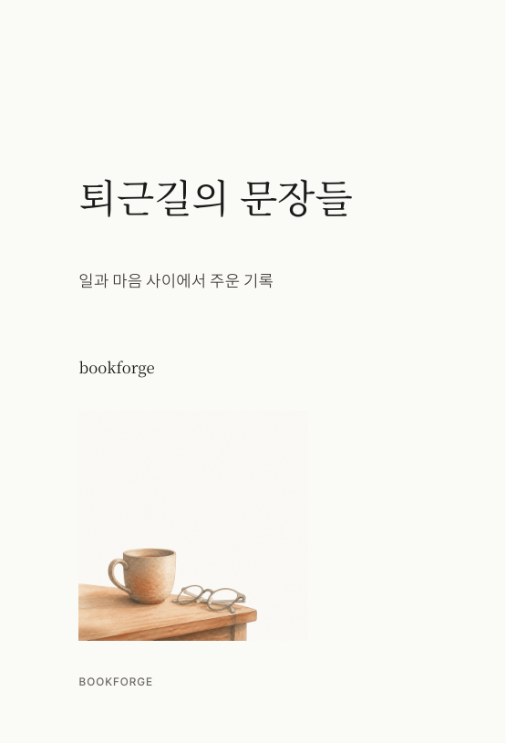](examples/essay-evening-sentences.pdf) | [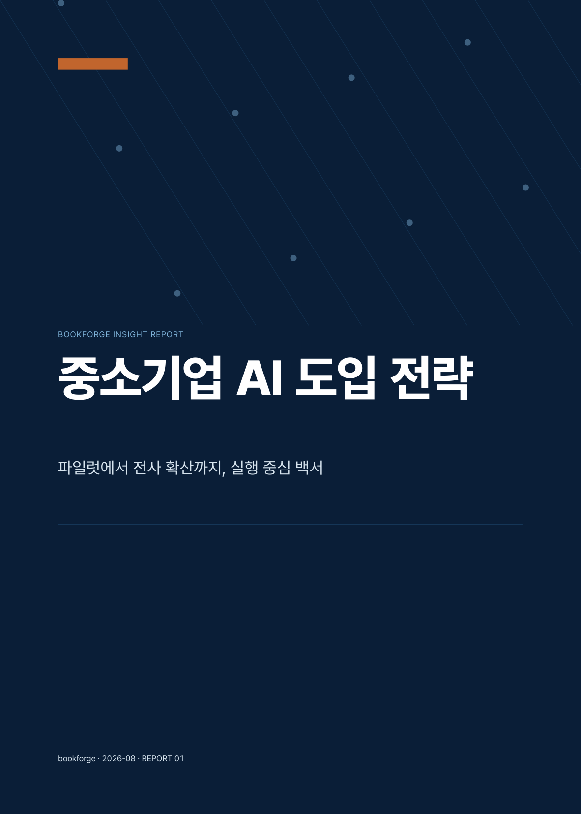](examples/business-sme-ai.pdf) | [](examples/magazine-trend-brief.pdf) |
| **essay** 미니멀 에세이<br>『퇴근길의 문장들』 32쪽 | **business** 컨설팅 백서<br>『중소기업 AI 도입 전략』 28쪽 | **magazine** 트렌드 매거진<br>『TREND BRIEF』 25쪽 |

### 내지 미리보기

| practical — 반복 지면 템플릿 | business — Executive Summary | magazine — 이미지 면 |
|:---:|:---:|:---:|
| 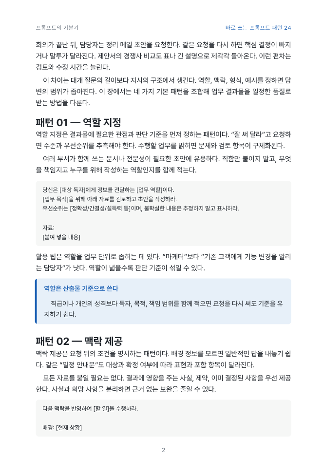 | 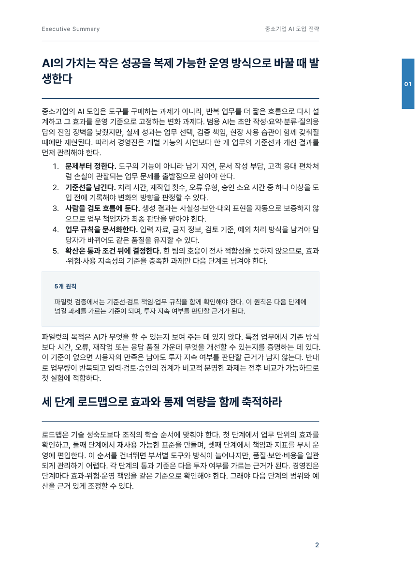 | 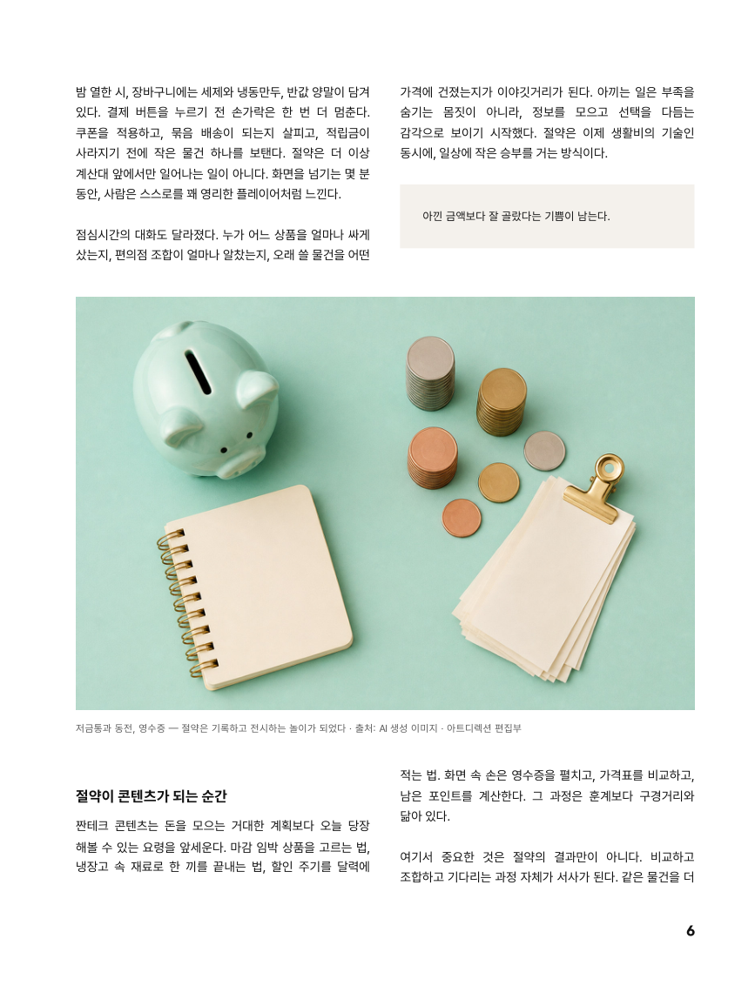 |

| academic — 정의 박스·절 위계 | essay — 여백 낙차형 장 시작 | insight — narrow 측정·키 스탯 |
|:---:|:---:|:---:|
| 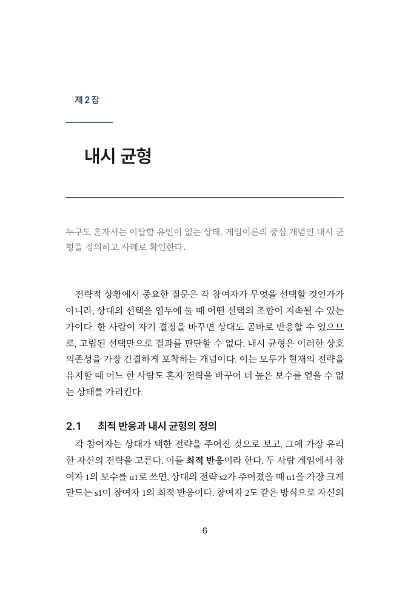 | 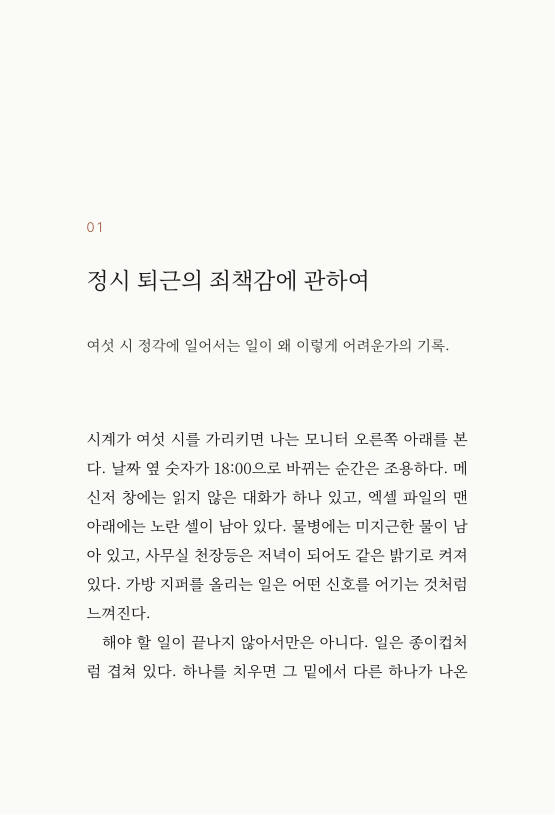 | 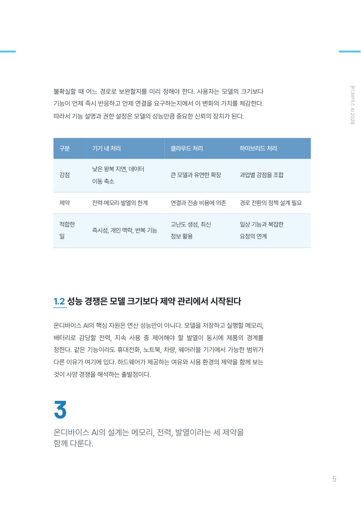 |

## 스타일 6종

각 스타일은 실제 상업 출판물을 계측·증류한 규칙서(`styles/*/STYLE.md`)를 갖습니다 — 판형 mm, 폰트 pt, 행간 %, 컬러 토큰, 지면 템플릿, 금지 사항까지.

| 스타일 | 정체성 | 판형 | 엔진 |
|---|---|---|---|
| `practical` | IT·실용 활용서 (단계별 가이드·용어집) | 153×225 | Typst |
| `insight` | 기술 동향 리포트 (연구기관 인사이트) | 182×257 | HTML→Chromium |
| `academic` | 학술 단행본 (신국판·3선표·절 번호 위계) | 153×225 | Typst |
| `essay` | 미니멀 에세이 (사륙판·먹 1도+포인트 1색) | 128×188 | Typst |
| `business` | 컨설팅 백서 (navy 시스템·액션 타이틀·키 스탯) | 200×280 | Typst |
| `magazine` | 트렌드 매거진 (에디토리얼 그리드·풀퀘트 면) | 200×265 | HTML→Chromium |

## 설치

```bash
git clone https://github.com/kimsh-1/bookforge.git
cd bookforge

# Claude Code + Codex 양쪽에 심링크 (둘 다 심링크 공식 지원)
ln -sfn "$PWD" ~/.claude/skills/bookforge
ln -sfn "$PWD" ~/.codex/skills/bookforge
ln -sfn "$PWD" ~/.agents/skills/bookforge
```

요구 사항 (스킬이 실행 전 자체 점검):

- **Typst 0.14+** — `practical`·`academic`·`essay`·`business`
- **Python 3 + PyMuPDF + markdown-it-py** — 변환·QC 게이트 (`pip install pymupdf markdown-it-py`)
- **Playwright(Chromium)** — `insight`·`magazine`만 (`npm i -g playwright && npx playwright install chromium`)

폰트는 OFL 5종(Pretendard·Noto Serif KR·Paperlogy·Gmarket Sans·Barlow)이 레포에 동봉되어 바로 렌더됩니다 — [라이선스 고지](assets/fonts/LICENSES.md).

## 사용법

에이전트에게 말하면 됩니다:

```
"온디바이스 AI 동향을 insight 스타일 전자책으로 만들어줘"     ← topic 모드: 조사→목차→집필→조판
"이 원고(draft.docx)를 에세이집 PDF로 조판해줘"               ← manuscript 모드: 인제스트→조판
```

스킬이 모드를 감지하고 스타일·분량을 정해 끝까지 진행합니다. 수동 실행도 가능합니다:

```bash
python3 scripts/scaffold.py mybook --style essay --title "제목" --length short
# chapters/*.md 와 outline.json 작성 후
python3 scripts/build.py mybook        # → draft/book.pdf
python3 scripts/qc_gate.py mybook      # 게이트 통과 시에만 → final/mybook.pdf
```

## 품질 게이트

`final/`은 게이트 스크립트만이 만들 수 있습니다:

| 게이트 | 검사 |
|---|---|
| G1 | 렌더 성공 + 분량 프리셋 범위 |
| G2 | 폰트 전량 임베드 |
| G3 | 본문 bbox 오버플로 0 |
| G4 | 목차·북마크 ↔ 실제 장 시작 쪽 정합 |
| G5 | 의도치 않은 빈 페이지 0 |
| G6 | 콘택트시트 시각 검수 (에이전트가 실물 페이지를 눈으로 확인) |

## 구조

```
SKILL.md            라우터 (모드 감지 → 파이프라인 → 서브 문서 포인터)
modes/              topic.md · manuscript.md
styles/<6종>/       STYLE.md(규칙서) + theme.typ|theme.css + tokens.json
templates/base.typ  Typst 공통 북 프리미티브
scripts/            scaffold · build · qc_gate · contact_sheet · ingest_docx · fetch_fonts
references/         생성 아트 정책 · 오케스트레이션 · 스타일 팩 확장 가이드
examples/           예시 6종 PDF + 쇼케이스
```

생성 이미지 정책: 표지·본문 아트는 **무텍스트 생성 이미지**만 사용하고, 모든 글자는 조판 레이어가 벡터로 얹습니다. 생성 이미지가 실린 책은 캡션·판권면에 표기합니다.

## 라이선스

코드·문서: MIT. 동봉 폰트: 각 폰트의 OFL 1.1 ([고지](assets/fonts/LICENSES.md)). 예시 PDF 6종은 스킬 데모 산출물입니다.
