# bookforge

**주제 한 줄 → 상업도서급 전자책 PDF.** Claude Code와 OpenAI Codex 양쪽에서 동작하는 에이전트 스킬입니다.

[English](README.en.md)

표지·리더선 목차·장 도비라·러닝 헤드·판권면까지 실제 단행본의 해부 구조를 갖춘 PDF를 만듭니다. 콘텐츠는 마크다운으로만 쓰고, 조판은 스타일 팩 6종과 스크립트가 전담하며, 품질은 QC 게이트가 물리적으로 강제합니다 — 게이트를 통과하지 못한 PDF는 `final/`에 존재할 수 없습니다. 페이지를 어떻게 나누고, 채우고, 비우는지는 상업 단행본 실측에 기반한 배치 규칙서([references/pagination.md](references/pagination.md))가 정하며, 밀도 게이트가 "이유 없는 비움"과 "억지 채움"을 수치로 잡아냅니다.

게이트는 산출물만 보지 않습니다. 스타일 팩의 색·수치 계약 자체를 렌더 전에 검증하고(G16), 문서 전체가 조용히 축소되어 나가는 사고를 절대 급수 대조로 차단하며(G1-SCALE), 도해가 면을 분단하거나 판면을 넘는 배치를 최종 지면에서 재확인합니다(G17). 이 감도들은 뮤테이션 스위트(`tests/mutations/`)가 회귀로 고정합니다 — 결함을 일부러 주입한 책이 게이트에 걸리는지, 정상 책이 오탐당하지 않는지를 판정 축 25개(무변조 대조군 M0 포함)로 검사합니다.

데모 영상과 예시 PDF 3권은 [v2.0.0 릴리스](https://github.com/gongnyang/bookforge/releases/tag/v2.0.0)에 첨부되어 있습니다.

## 예시 9종 — 전부 이 스킬이 만든 실물입니다

여섯 스타일 전부에 실물 예시가 있고, `practical`·`insight`·`business`는 도해 트랙이 주인공인 책을 하나씩 더해 총 아홉 권입니다(v2.0.0 릴리스 시점 산출물). 각 표지를 클릭하면 PDF 전문이 열립니다.

| | | |
|:---:|:---:|:---:|
| [](examples/practical-prompt-patterns.pdf) | [](examples/insight-ondevice-ai.pdf) | [](examples/academic-game-theory.pdf) |
| **practical** 실용·활용서<br>『바로 쓰는 프롬프트 패턴 24』 45쪽 | **insight** 기술 리포트<br>『온디바이스 AI 2026』 28쪽 | **academic** 학술·논문형<br>『게임이론의 기초』 36쪽 |
| [](examples/essay-evening-sentences.pdf) | [](examples/business-sme-ai.pdf) | [](examples/magazine-trend-brief.pdf) |
| **essay** 미니멀 에세이<br>『퇴근길의 문장들』 32쪽 | **business** 컨설팅 백서<br>『중소기업 AI 도입 전략』 28쪽 | **magazine** 트렌드 매거진<br>『TREND BRIEF』 25쪽 |
| [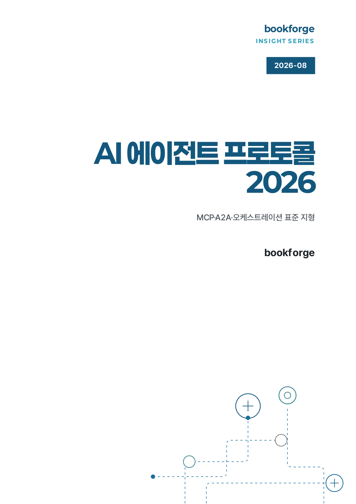](examples/insight-agent-protocols.pdf) | [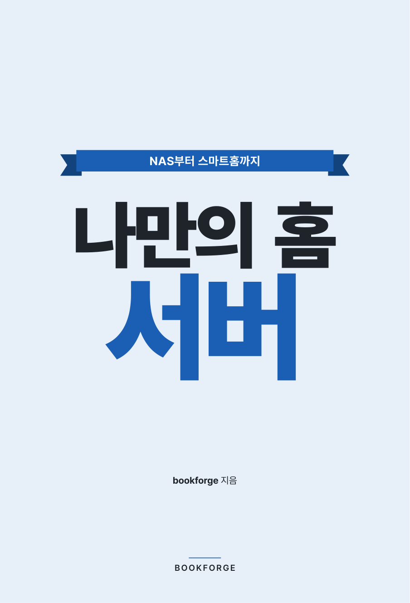](examples/practical-home-server.pdf) | [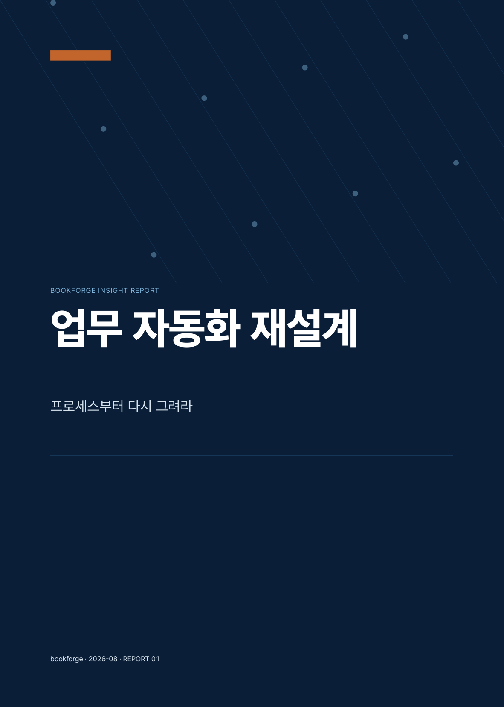](examples/business-automation-redesign.pdf) |
| **insight** 도해 중심<br>『AI 에이전트 프로토콜 2026』 32쪽 | **practical** 도해 중심<br>『나만의 홈 서버』 39쪽 | **business** 도해 중심<br>『업무 자동화 재설계』 31쪽 |

## 도해 트랙

본문 도해는 에이전트가 사이드카 파일로 선언하고, 빌드가 정규화·검증까지 마쳐 벡터로 얹습니다. 두 트랙으로 나뉩니다.

1. **antv** — 순서·비교·계층·수치 추이 같은 요점 시각화는 `diagrams/fig-NN.json`에 AntV Infographic DSL로 선언합니다. 렌더러는 저장소에 커밋된 벤더 번들(`vendor/antv-ssr.bundle.mjs`, `@antv/infographic` 0.2.19 고정)로 SSR하고, 원본 출력의 `<foreignObject>` 텍스트를 네이티브 `<text>`로 변환(fo2text)해 Typst(usvg)에서 텍스트가 조용히 사라지는 사고를 막습니다.
2. **authored** — AntV 카탈로그가 커버하지 못하는 기술도해 11계열(시퀀스·상태머신·ER·스위밍레인·간트·레이더·벤·산점도·조직도·루프·권한 매트릭스)은 에이전트가 SVG를 직접 그립니다. `diagrams/fig-NN.svg` + 사이드카 `{"kind":"authored"}`를 두면 빌드가 폰트 베이크·팔레트 강제·라벨 겹침 검사·최소 8pt 하한까지 정규화해 `assets/fig-NN.svg`로 산출합니다. 작성 계약·타입 라우팅·커넥터 규칙·복잡도 예산은 [references/diagrams.md](references/diagrams.md)가 정본입니다([cathrynlavery/diagram-design](https://github.com/cathrynlavery/diagram-design)(MIT)의 명세를 한국어 조판·팔레트 토큰·게이트 체계에 맞게 재서술해 흡수).

도해의 색과 크기는 스타일 팩과 계약으로 묶입니다. 팔레트의 각 색은 역할(`palette_roles`: label·fill·stroke)이 선언되어 라벨 색을 면 채움에 쓰는 식의 역할 위반이 게이트에 걸리고, 라벨 급수는 본문 대비 상한(`diagram.labelBand.maxRatio`)을 넘을 수 없습니다. 배치 높이도 계약입니다 — `diagram.maxHeightMm`를 넘는 도해는 렌더 단계가 사전 축소하거나 반려하고(figFitReport), 그 우회까지 최종 PDF에서 G17-FIGFIT이 잡습니다(면 분단·판면 초과·높이 재산출 대조). 소스는 렌더 전 G0이, 라벨 텍스트의 PDF 실재는 렌더 후 G13이 검증합니다.

| insight — 계층(트리) | business — 스위밍레인 | practical — 플로우차트 |
|:---:|:---:|:---:|
| 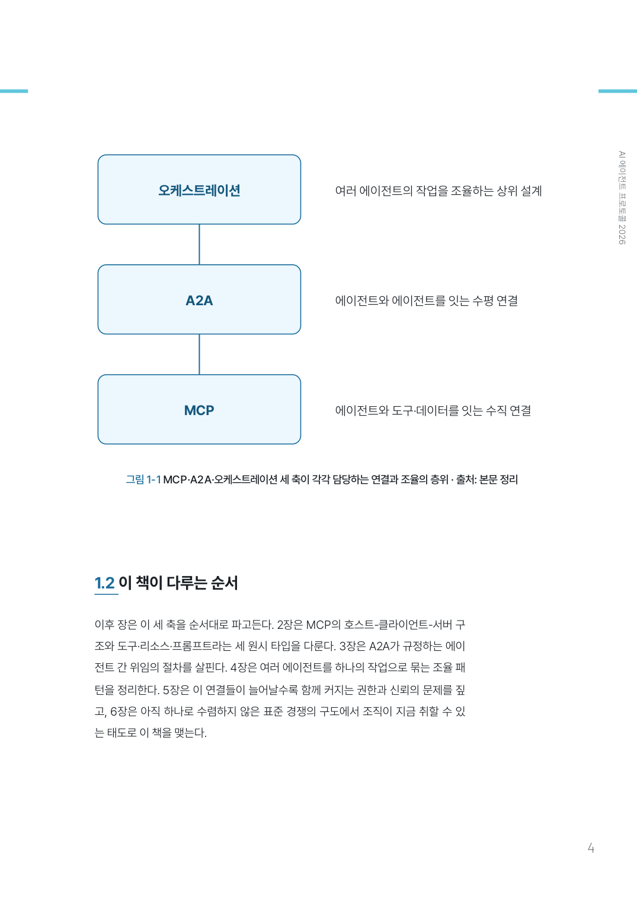 | 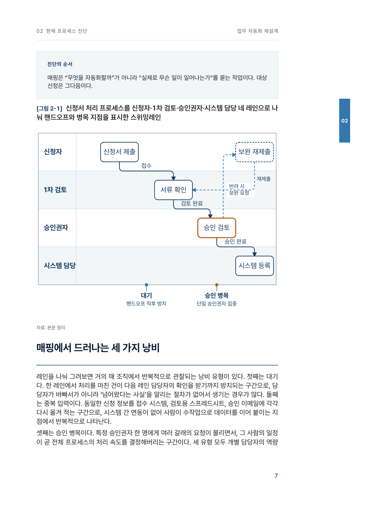 | 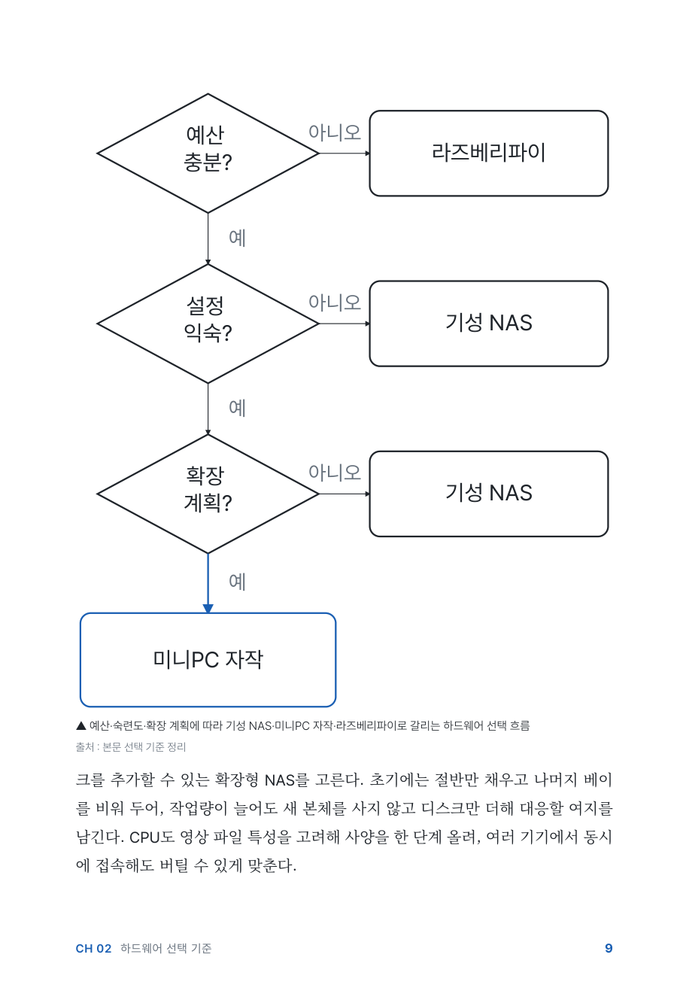 |

## 목차 시스템

목차는 스타일마다 문법이 다르고, 그 문법은 선언된 계약입니다. 스킬 한 곳의 레이아웃 카탈로그(`TOC_LAYOUTS` 6종)에 각 레이아웃의 레벨 수·리더선 유무·급수 상한이 실측으로 등재되어 있고, 팩은 `tokens.json`의 `toc_layout`으로 이름만 고릅니다 — 테마 실물이 선언과 어긋나면 G16-SYNC가 빌드 전에 잡습니다.

| 레이아웃 | 스타일 | 문법 |
|---|---|---|
| `hanging-two-level` | insight | 장 행 + 들여쓴 절 행, 넘치면 **다면 발행**(`toc_overflow: paginate` — 2패스 쪽번호 마커) |
| `spread-single-level` | magazine | 스프레드 1면 고정, 장 레벨만, 넘침은 빌드 중단 |
| `display-numeral` | business · magazine(대안) | 좌측 대형 장번호 칼럼 + 우측 제목/절 |
| `twocol-balanced` | practical | 헤더 밴드 + 장 서수 칩 + 점선 리더, 넘치면 2단 균형 분할 |
| `academic-flow` | academic | 번호 칼럼 + 제목 + 우단 쪽번호 |
| `flush-single-level` | essay | 장 레벨만, 리더선 금지 |

기본 레이아웃 외에 **대안 오버레이**를 책 단위로 켤 수 있습니다 — `book.json`에 `toc_layout`을 선언하면 magazine이 `display-numeral`로 조판되고, 대안 레이아웃의 단면 용량은 별도 실측 계약(`toc_capacity_alt`)이 지킵니다. 다면 목차 스타일에서는 **그림·표 차례**(`toc_lists` 옵트인)를 별면으로 발행할 수 있고, 그 쪽번호까지 게이트가 대조합니다.

목차·디자인 정합은 G14가 5축으로 스캔합니다: **A** 인쇄 목차 쪽번호↔실제 폴리오 / **B** 목차↔장 도비라 색상(hue) 계열 / **C** 유채색 텍스트의 배경 대비 WCAG 하한 / **D** 절 행 쪽번호↔실제 절 시작면 / **E** 그림·표 차례 쪽번호↔실제 캡션 면. 아래 두 권의 목차가 실제 통과본입니다.

| insight — 사이드 밴드·폴리오 | business — 인디케이터·챕터 넘버 |
|:---:|:---:|
| 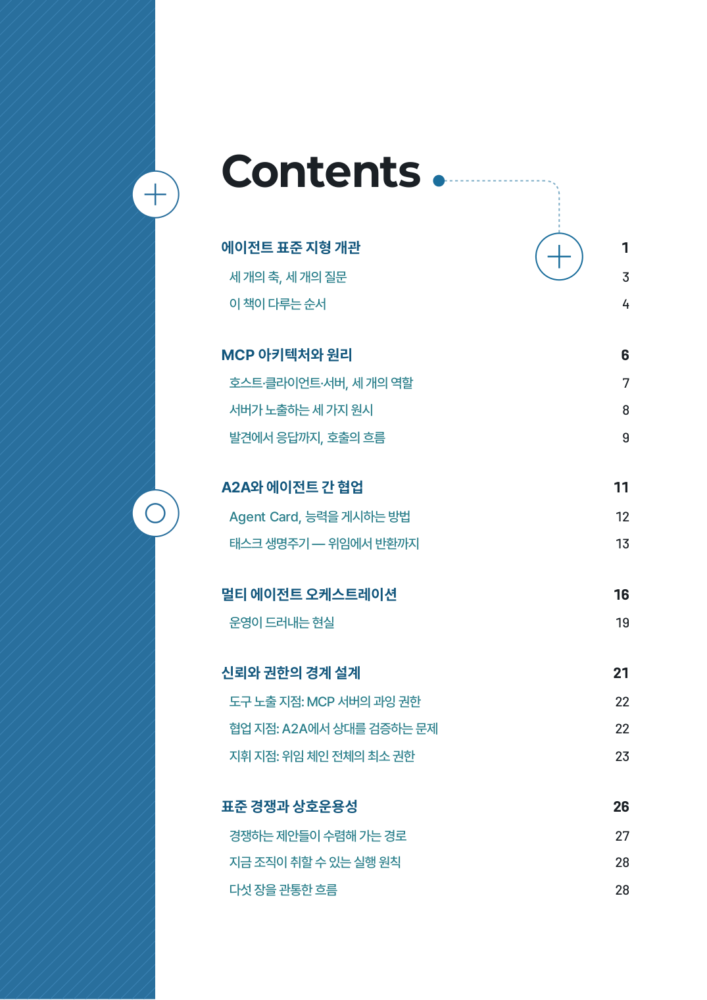 | 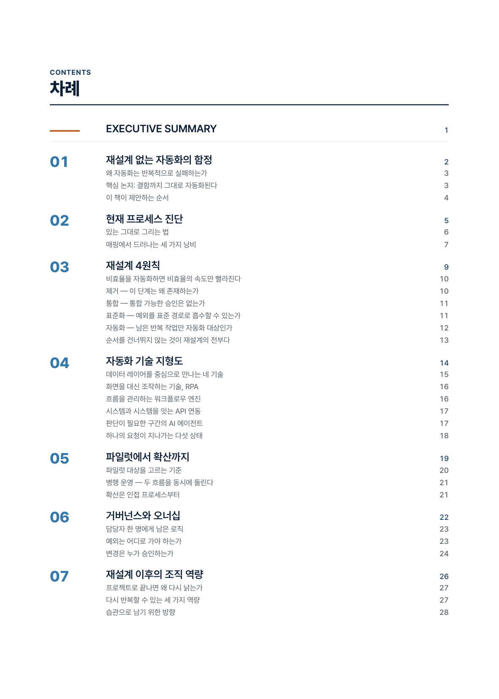 |

## 내지 미리보기

| practical — 콜아웃·절차 지면 | business — 표·데이터 근거 | magazine — 이미지·풀퀘트 면 |
|:---:|:---:|:---:|
| 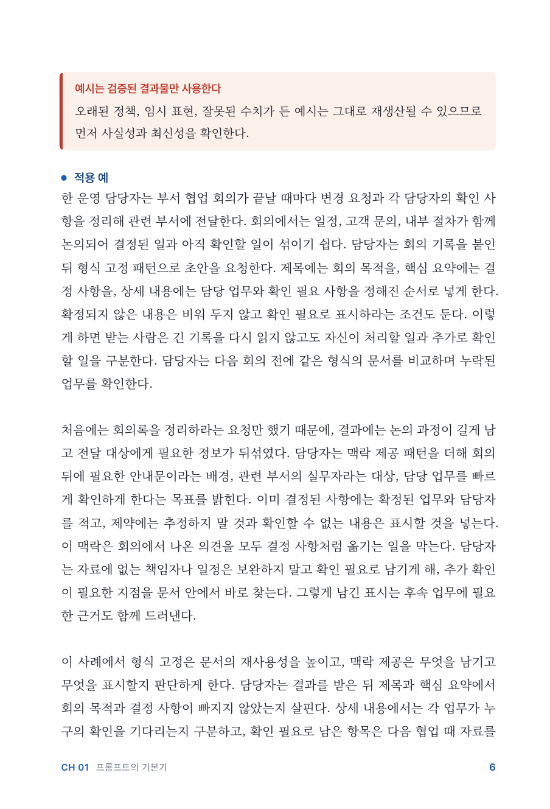 | 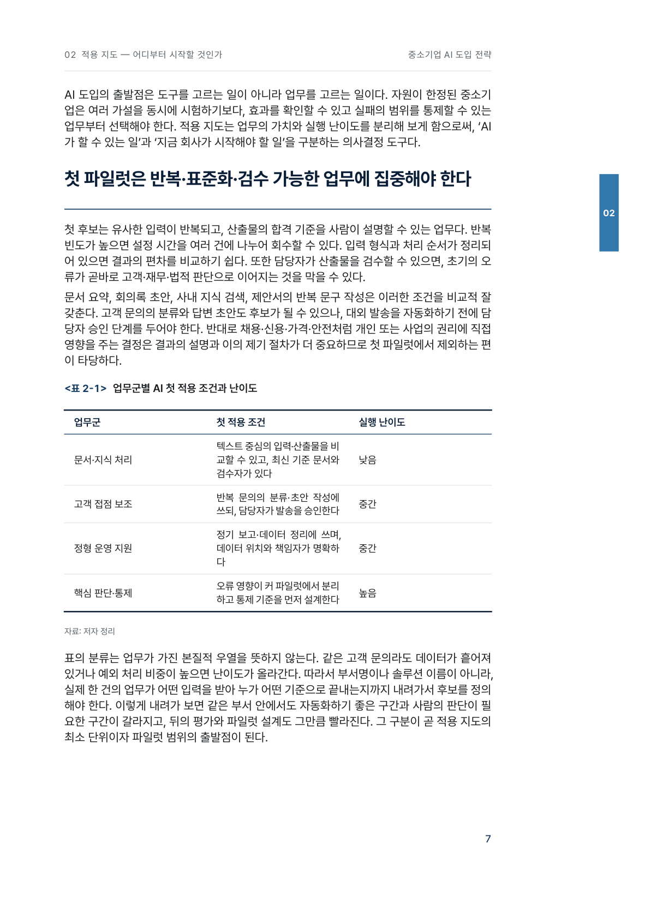 |  |

| academic — 정의 박스·절 위계 | essay — 여백 낙차형 지면 | insight — narrow 측정 표 |
|:---:|:---:|:---:|
| 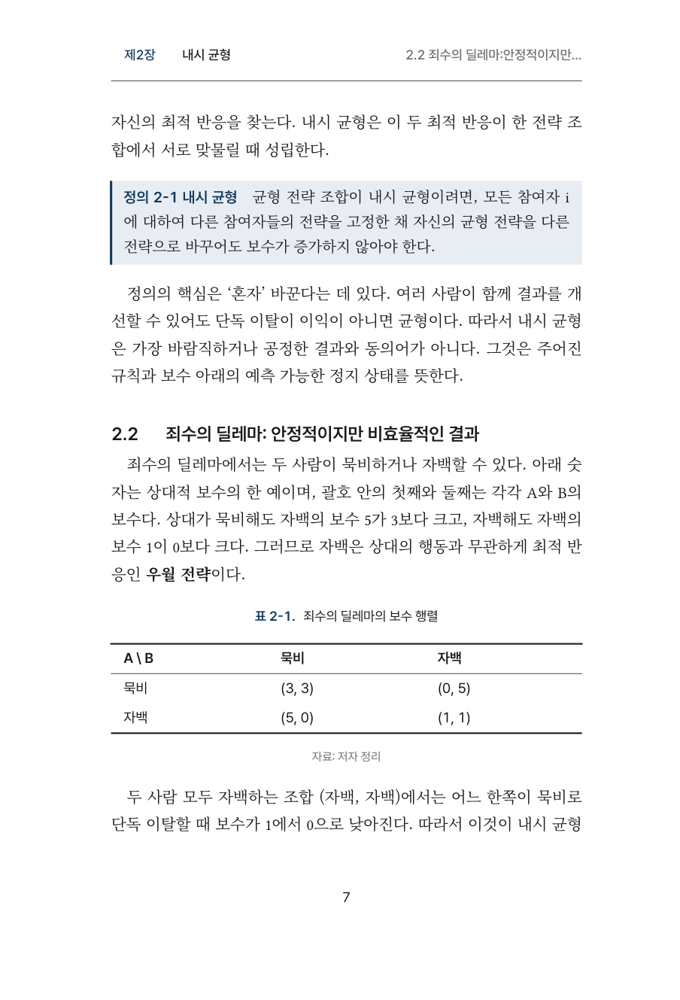 | 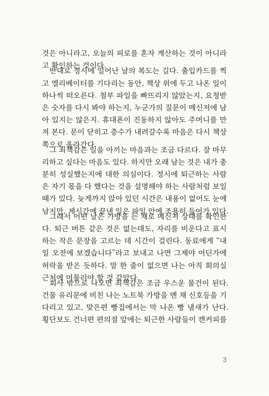 | 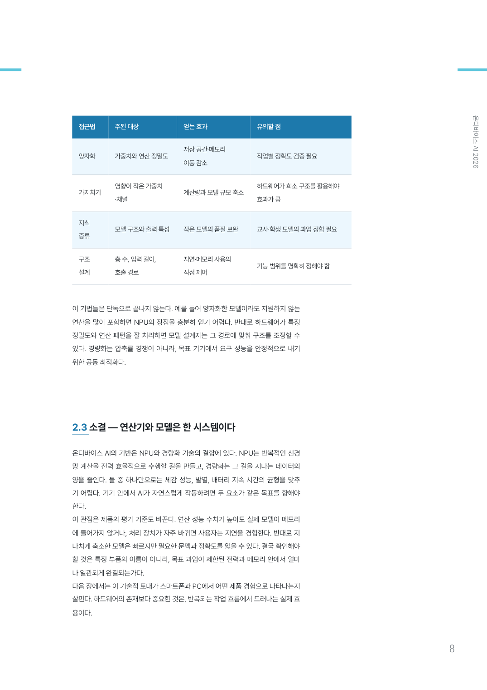 |

## 스타일 6종

각 스타일은 실제 상업 출판물을 계측·증류한 규칙서(`styles/*/STYLE.md`)를 갖습니다 — 판형 mm, 폰트 pt, 행간 %, 컬러 토큰, 지면 템플릿, 금지 사항까지.

| 스타일 | 정체성 | 판형 | 엔진 |
|---|---|---|---|
| `practical` | IT·실용 활용서. 서술은 명조(Noto Serif KR)로 낮게 깔고 조작·라벨·수치는 고딕(Pretendard)으로 세워 "읽는 글"과 "하는 글"을 서체로 분리한다 | 153×225 | Typst |
| `insight` | 기술 동향 리포트 (연구기관 인사이트) | 182×257 | HTML→Chromium |
| `academic` | 학술 단행본 (신국판·3선표·절 번호 위계) | 153×225 | Typst |
| `essay` | 미니멀 에세이 (사륙판·먹 1도+포인트 1색) | 128×188 | Typst |
| `business` | 컨설팅 백서 (navy 시스템·액션 타이틀·키 스탯) | 200×280 | Typst |
| `magazine` | 트렌드 매거진 (에디토리얼 그리드·풀퀘트 면) | 200×265 | HTML→Chromium |

`practical`은 표지도 카탈로그입니다 — 기본은 백지 위 오버사이즈 고스트 숫자의 `numeral`이고, `book.json`의 `cover_variant`로 `ribbon`(구 기본)·`block`·`grid`·`obi`를 옵트인할 수 있습니다. 카탈로그 밖 값은 침묵 폴백 없이 즉시 실패합니다.

## 설치

```bash
git clone https://github.com/gongnyang/bookforge.git
cd bookforge

# Claude Code + Codex 양쪽에 심링크 (둘 다 심링크 공식 지원)
ln -sfn "$PWD" ~/.claude/skills/bookforge
ln -sfn "$PWD" ~/.codex/skills/bookforge
ln -sfn "$PWD" ~/.agents/skills/bookforge
```

요구 사항 (스킬이 실행 전 자체 점검):

- **Typst 0.14+** — `practical`·`academic`·`essay`·`business`
- **Python 3 + PyMuPDF + markdown-it-py** — 변환·QC 게이트 (`pip install pymupdf markdown-it-py`)
- **전역 Playwright(Chromium)** — `insight`·`magazine` **그리고 도해(diagrams/)를 쓰는 모든 책**(도해 프리렌더는 Typst 스타일에서도 Chromium 하네스를 거친다) — `npm i -g playwright && npx playwright install chromium`. 빌드는 **전역** `npm root -g`에서 playwright를 해석하므로 프로젝트 로컬 설치로는 안 잡힌다
- **도해(diagrams/)를 쓰는 책만** — 렌더러는 저장소에 커밋된 벤더 번들(`vendor/antv-ssr.bundle.mjs`)을 쓴다. **`npm ci`는 불필요** — npm 레지스트리가 사라져도 재현된다. 번들이 유실됐을 때만 스킬 폴더에서 `npm ci && node vendor/build-bundle.mjs`로 복구

폰트는 OFL 5종(Pretendard·Noto Serif KR·Paperlogy·Gmarket Sans·Barlow)이 **전량 TrueType(TTF)**으로 레포에 동봉되어 바로 렌더됩니다 — Chromium print-to-PDF는 CFF(.otf) 서브셋을 못 해 페이지마다 글리프를 벡터로 다시 그리는 Type3로 조용히 폴백한다(실측: 동일 본문 기준 OTF는 Type3 오브젝트 19개, 변환한 TTF는 Type0 서브셋 1개·Type3 0개). G2 게이트가 이 Type3 0건을 하드 조건으로 강제한다 — [라이선스 고지](assets/fonts/LICENSES.md).

## 사용법

에이전트에게 말하면 됩니다:

```
"온디바이스 AI 동향을 insight 스타일 전자책으로 만들어줘"     ← topic 모드: 조사→목차→집필→조판
"이 원고(draft.docx)를 에세이집 PDF로 조판해줘"               ← manuscript 모드: 인제스트→조판
```

스킬이 모드를 감지하고 스타일·분량을 정해 끝까지 진행합니다. 도해가 필요한 장은 `diagrams/fig-NN.json`(antv) 또는 `diagrams/fig-NN.svg`(authored)을 두면 빌드 단계에서 자동으로 프리렌더됩니다. 수동 실행도 가능합니다:

```bash
python3 scripts/scaffold.py mybook --style essay --title "제목" --length short
# chapters/*.md 와 outline.json 작성 후
python3 scripts/build.py mybook        # → draft/book.pdf (도해가 있으면 여기서 자동 프리렌더)
python3 scripts/qc_gate.py mybook      # 게이트 통과 시에만 → final/mybook.pdf
```

## 품질 게이트

`final/`은 게이트 스크립트만이 만들 수 있습니다. 기계 게이트 17종·판정 축 30개가 `gate-report.json`에 등록되고, 여기에 시각 검수 G6(에이전트가 콘택트시트를 눈으로 확인)이 더해집니다.

| 게이트 | 검사 |
|---|---|
| G0 | (렌더 전) 도해 SVG 소스 — `foreignObject` 잔존·텍스트 부재·외부 참조·단독 문단 위반·사이드카 무결성·아이콘 탈락 차단 |
| G1 | 렌더 성공 + 판형(`tokens.trim_mm`) 대조 + 분량 프리셋 범위(WARN — `--strict-pages`만 HARD) + **G1-SCALE: 본문 절대 급수(`tokens.body_pt`) 대조 — Chromium shrink-to-fit이 문서 전체를 조용히 축소해 상대 지표 게이트를 전부 통과시키는 사고 계열의 유일한 검출축** |
| G2 | 폰트 전량 임베드 + **Type3 글리프 0** |
| G3 | 면 기하 3축 — **OVERFLOW**(재단 밖 bbox 0, 허용오차 1.5pt) · **COLLIDE**(같은 면 텍스트 라인 교차 0, 다단은 컬럼 밴드별) · **FIT**(앞부속 텍스트가 선언 프레임 `front_frame_mm` 안) |
| G4 | 목차·북마크 ↔ 실제 장 시작 쪽 정합 |
| G6 | 콘택트시트 시각 검수 — 에이전트가 실물 페이지를 눈으로 확인 |
| G7 | 밀도 5축 — 판면 드리프트·의도치 않은 빈 페이지·꼬리 미달·중간 공백·문서 전체 (reach/ink/gap) |
| G8 | 공기 채움(행간·자간을 늘려 억지로 채운 흔적) 탐지 |
| G9 | 면 끝 제목 고립·widow (단일단 스타일) |
| G10 | (렌더 전) 콜아웃·인용·스탯 수치가 챕터 본문에 실재 — 날조 차단 |
| G11 | `pageroles.json`(의도된 여백 사유 코드) 무결성 |
| G12 | 장 시작 직전 필러 백면 0 (단면 전자책에 인쇄 관습의 recto 맞춤 금지) |
| G13 | (렌더 후) 도해 라벨이 PDF 실텍스트로 존재 — SVG→PDF 변환 중 텍스트 드롭 최종 포착 |
| G14 | 목차·디자인 정합 5축 — A 인쇄 목차 쪽번호↔폴리오 / B 목차↔도비라 색상(hue) 계열 / C 유채색 텍스트 대비 WCAG 하한(대형 3:1, 그 외 4.5:1) / D 절 행 쪽번호↔절 시작면 / E 그림·표 차례↔캡션 면 |
| G15 | 지면 리듬 2축 (`business` 한정, 실측 근거 있는 곳만 강제) — 단락 8행 초과 / 시각 요소 없는 연속 본문 면 상한 |
| G16-TOKENS | (렌더 전 · `build.py`) 스타일 팩 토큰 계약 3축 — **SYNC**(engine↔팩 실물·팔레트 역할·목차 레이아웃 카탈로그·도해 폭 치환 계약 정합) / **CONTRAST**(선언 페어의 WCAG 대비를 pt·bold 파생 하한과 대조) / **BRAND**(브랜드 입력의 형식·치환 지점 대비·동반색 hue 정합). **빌드를 그 자리에서 중단시킬 수 있는 유일한 게이트**라 실패 시 `gate-report.json`이 아직 없다 — stderr의 축·사유를 읽고 `styles/<style>/tokens.json`을 고칠 것 |
| G16-LINT | (`qc_gate` · html 엔진 한정) `contrast_contract` ↔ `theme.css`·렌더 DOM 실물 대조 — 완전성(WARN) / pt 정합(HARD) / 값 커버리지(HARD). typst 스타일은 렌더 DOM이 없어 명시 skip |
| G17-FIGFIT | (렌더 후) 도해 figure가 한 면 안 — 면 분단·판면 초과·배치 높이 정적 재산출 ≤ `diagram.maxHeightMm`. 렌더 단계 사전 축소/반려(figFitReport)의 우회까지 지면에서 이중 방어 |

기준 수치와 대응법은 [references/pagination.md](references/pagination.md)가, 도해 트랙의 작성 계약은 [references/diagrams.md](references/diagrams.md)가 정본이다. 게이트 감도 자체는 뮤테이션 스위트가 지킨다 — `python3 tests/mutations/run_mutations.py <게이트 통과 책>`이 결함 주입 24축 + 무변조 대조군으로 검출·오탐 양방향을 회귀 검사한다.

## 구조

```
SKILL.md            라우터 (모드 감지 → 파이프라인 → 서브 문서 포인터)
AGENTS.md           세션 모드 이원화 (스킬 사용 vs 메인테이너)
modes/              topic.md · manuscript.md
styles/<6종>/       STYLE.md(규칙서) + theme.typ|theme.css + tokens.json
templates/base.typ  Typst 공통 북 프리미티브
vendor/             antv-ssr.bundle.mjs(커밋된 AntV SSR 번들 — 오프라인 재현성) + build-bundle.mjs
scripts/            scaffold · build(+G16-TOKENS) · build_html(다면 목차 2패스) · qc_gate ·
                    tocgate(G14) · g16_tokens · render_diagrams(도해 프리렌더) · refit ·
                    contact_sheet · convert_fonts(TTF 전환) · fetch_fonts · ingest_docx
tests/              lint_contrast.py(G16-LINT) · mutations/(게이트 감도 회귀 스위트)
references/         배치 규칙서(pagination.md) · 도해 계약(diagrams.md) · 생성 아트 정책 ·
                    오케스트레이션 · 스타일 팩 확장 가이드(extending.md)
examples/           예시 9권 PDF + 쇼케이스 36컷
```

생성 이미지 정책: 표지·본문 아트는 **무텍스트 생성 이미지**만 사용하고, 모든 글자는 조판 레이어가 벡터로 얹습니다. 생성 이미지가 실린 책은 캡션·판권면에 표기합니다.

## 라이선스

코드·문서: MIT. 동봉 폰트: 각 폰트의 OFL 1.1 ([고지](assets/fonts/LICENSES.md)). 예시 PDF 9종은 스킬 데모 산출물입니다.
